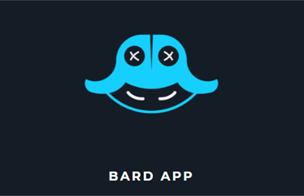
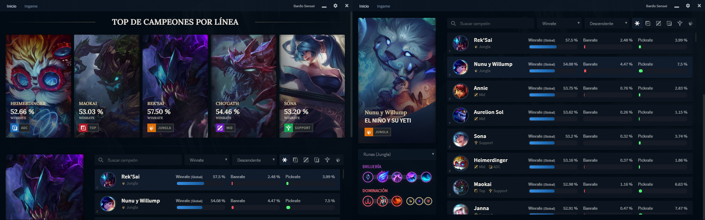
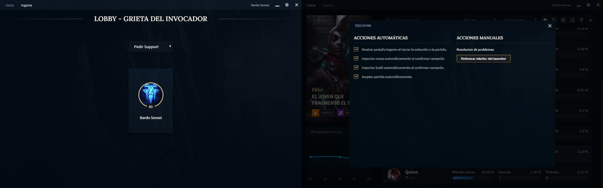
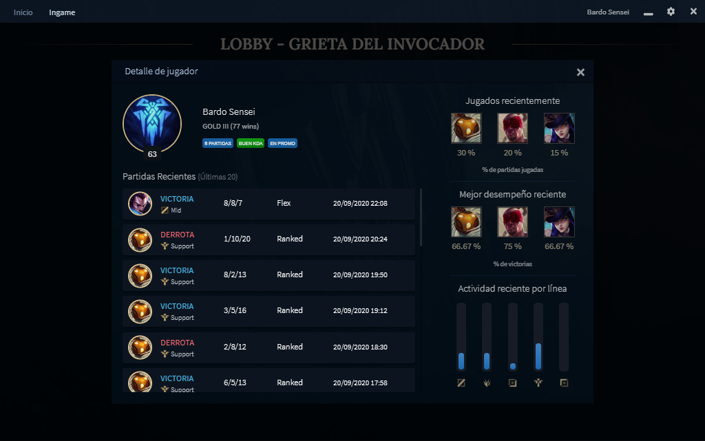
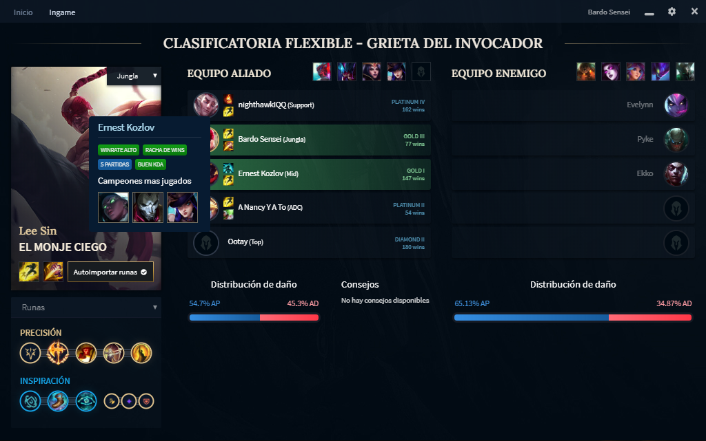
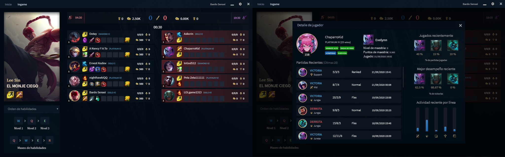

## Bard App (Work in progress)

**Aplicación de escritorio con estadísticas en tiempo real y utilidades de League of Legends**

Frontend hecho con Javascript (Electron, ReactJS), backend con Python (Django, Pandas, Celery).

[Repositorio de Frontend](https://github.com/fabran99/LolHelperFrontend)

## Funcionamiento del backend

El backend hace uso de [la api de Riot Games](https://developer.riotgames.com/apis) para solicitar partidas periódicamente y generar estadísticas.

- Se solicita una lista de jugadores aleatorios de todos los servidores y elos.
- Periódicamente se solicitan partidas de estos jugadores de los últimos 3 días.
- Las partidas se van procesando y guardando sus estadísticas utilizando una cola de celery.
- Periódicamente se actualizan los enlaces de los assets del juego, que se cargan desde cddragon, y se actualizan las estadísticas globales de cada personaje en base a los datos extraidos de las partidas en el paso anterior.
- Se sirven las estadísticas finales usando django.

## Funcionalidades

**Estadísticas actualizadas de todos los campeones**

1.  Winrate, Pickrate, Banrate
2.  Líneas usuales
3.  Build y runas por línea
4.  Counters
5.  Orden de habilidades
6.  Distribución de daño (AP, AD)
7.  Análisis de campeón (CS, KDA, daño)
8.  Top de personajes por línea

**Conexión en tiempo real con League Launcher**

- Detección automática de eventos del launcher (Inicio de sesión, entrada a lobby, selección de campeón, partida en curso)
- Carga manual o automática **(al bloquear campeón)** de runas óptimas.
- Carga manual o automática **(al bloquear campeón)** de build óptima directo a la tienda del juego.
- Confirmar automáticamente al encontrar partida.
- Solicitar línea automáticamente en partidas normales al entra a la sala.

**Estudio en tiempo real de jugadores en tu sala o partida**

- Personajes más jugados.
- Nivel de maestría con personaje seleccionado.
- Historial de partidas recientes.
- Personajes jugados recientemente.
- Líneas jugadas recientemente.
- Winrates y pickrates recientes.

**Ayuda en tiempo real durante selección de campeón**

- Recomendación de bans **(work in progress)**
- Estadísticas e información de compañeros de equipo.
- Distribución de daño de los equipos para sacar ventaja de equipos desbalanceados.
- Autoimport de runas y build recomendadas.

**Ayuda en tiempo real ingame**

- Timers de objetivos.
- Conteo de oro de objetos comprados de cada jugador.
- KDA, torres destruidas, farm, etc.
- Análisis de jugadores aliados y rivales.

## Funcionalidades futuras

- Predicción de ruta de jungla.
- Análisis post game.
- Sistema de logros.
- Asistente en tiempo real estilo GPS durante la partida, con consejos, recordatorios de timers de objetivos, etc.

[Descarga el último release](https://github.com/fabran99/LolHelperFrontend/releases/latest)
